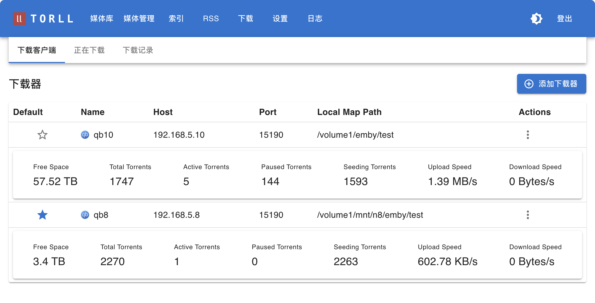

# 下载器处理模式

为了适应不同的部署环境，系统为每个下载客户端提供了三种文件处理模式。这些模式决定了当一个种子下载完成后，系统如何执行后续的“识别、重命名和创建硬链接”操作。

=== "下载器"
    

=== "下载任务"
    

## 触发机制

无论选择哪种模式，触发操作的方式都有两种：

1.  **自动触发**: 系统后台服务会定期检查下载器。当发现已完成的任务时，会根据其配置的模式自动执行相应操作。
2.  **手动触发**: 在“媒体库”页面，用户可以对任意媒体条目点击“重建硬链”按钮，手动触发一次完整的处理流程。

## 三种处理模式

您可以在 `设置 -> 下载器` 中，为每一个下载客户端单独配置处理模式。

### 1. `local` (本地处理模式)

*   **描述**: 这是默认模式。在此模式下，`torll2` 主程序会直接在它自己运行的服务器上执行所有的文件操作（重命名、创建硬链接）。
*   **适用场景**: 当 `torll2` 和下载客户端（如 qBittorrent）运行在**同一台物理机或虚拟机**上，并且 `torll2` 可以直接访问下载完成的文件时。
*   **配置**:
    *   **处理模式**: `local`
    *   **本地路径映射**: 必须正确填写，指向媒体库的根目录。

### 2. `agent` (远程代理模式)

*   **描述**: 在此模式下，`torll2` 会通过网络调用一个运行在下载机上的轻量级 `RCP Agent` 程序。所有文件操作（重命名、创建硬链接）都由这个 Agent 在远程下载机上完成。
*   **适用场景**: 当 `torll2` 和下载客户端运行在**不同的服务器**上时。例如，`torll2` 运行在A服务器，而qBittorrent运行在B服务器。
*   **配置**:
    *   **处理模式**: `agent`
    *   **RCP Agent URL**: 必须填写，指向远程下载机上 `rcp_agent.py` 服务的地址（例如 `http://192.168.1.10:8088`）。
    *   **本地路径映射**: 此项在此模式下**无效**，因为路径处理由 Agent 在远程完成。

### 3. `legacy` (兼容旧模式)

*   **描述**: 在此模式下，`torll2` 不会主动对下载完成的任务进行任何操作。它依赖于一个外部脚本（例如由 qBittorrent 的“下载后运行”功能触发的 `rcp.py` 脚本）来调用 `torll2` 的一个特定 API (`/api/torcp/process_tor`) 来上报信息并请求处理。
*   **适用场景**: 用于兼容旧的、由下载器主动触发的工作流程，或用于一些高级自定义场景。在这种模式下，torll2 的 "重建硬链" 和 "修改媒体项目" 对于远程服务器是不可用的。
*   **配置**:
    *   **处理模式**: `legacy`
    *   其他相关配置均在此模式下无效。

