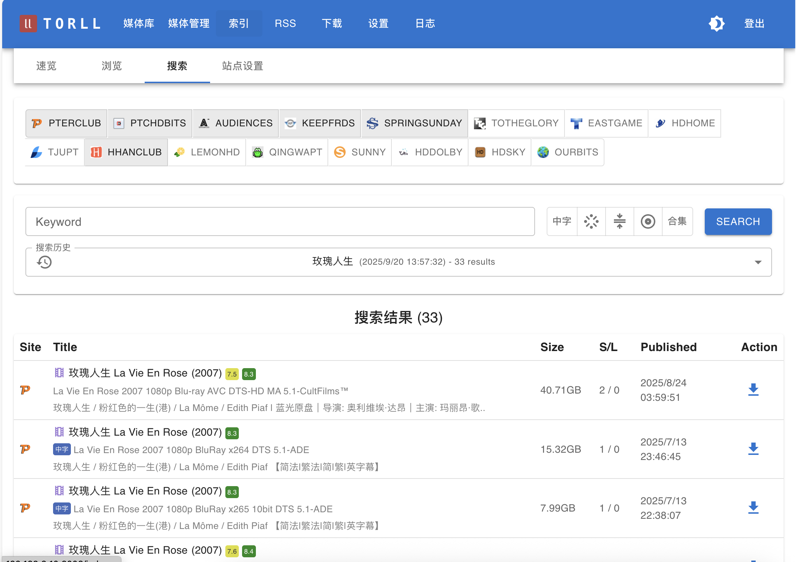

# 索引功能

`torll2` 的索引功能提供了多种方式来查找和发现内容，主要分为 **浏览**、**搜索** 和 **速览** 三种模式。你可以在 UI 的 **“索引”** 部分找到它们。

=== "索引"
    
=== "搜索"
    

---

## 1. 浏览 (Browse)

**“浏览”** 功能允许你直接访问并翻阅某个特定站点的种子列表，就像你在该站点的官网上操作一样。

- **入口**: 在 **索引** -> **站点设置** 页面，每个站点条目后面通常会有一个“浏览”或类似的按钮。
- **工作方式**: 点击后，`torll2` 会向该站点的服务器发起请求，获取种子列表的第一页内容并展示出来。你还可以进行翻页操作。
- **高级用法**: 如果站点的浏览页面支持通过 URL 参数进行过滤（例如，筛选特定分类），你可以在调用此功能时传入相应的参数，实现更精确的浏览。

**适用场景**: 当你想查看某个特定站点的最新种子，或者想在站点的特定分类下寻找资源时，此功能非常有用。

---

## 2. 搜索 (Search)

**“搜索”** 是一个强大的全局功能，它允许你同时在多个已配置的站点中查找同一个关键词。

- **入口**: 在 **索引** -> **搜索** 页面。
- **工作方式**: 
    1. 输入你要查找的 **关键词**。
    2. （可选）选择你希望在哪几个 **站点** 或哪几个 **标签** 范围内进行搜索。如果留空，则默认在所有“启用搜索”的站点中进行。
    3. 点击“搜索”后，`torll2` 会并发地向所有目标站点发送搜索请求。
    4. 结果会实时返回并展示在页面上。
- **搜索历史**: 系统会自动保存你的每一次搜索记录（关键词和时间戳）。你可以通过 **“搜索历史”** 查看，并点击任意一条记录来快速查看当时的结果，而无需重新搜索。

**适用场景**: 当你有一个明确的目标（如某部电影或剧集），并希望快速在所有可用站点中找到它时，这是最高效的方式。

---

## 3. 速览 (Quick View)

**“速览”** 功能用于查看和筛选所有已经被 `torll2` 通过各种方式（RSS、搜索、浏览等）发现并 **缓存在本地数据库中** 的种子信息。

- **入口**: 在 **索引** -> **速览** 页面。
- **工作方式**: 此功能查询的是 `torll2` 的本地数据库，**不会对外部站点产生任何网络请求**。它提供了一个所有已知种子的统一视图。
- **强大过滤**: 这是“速览”功能最大的特点。你可以使用多种条件对本地缓存的种子进行组合过滤，例如：
    - 站点
    - 标题关键词
    - 标签
    - 种子大小 (GB)
    - IMDB/豆瓣评分

**适用场景**: 当你想对已经收集到的资源进行分析、筛选和管理时，例如“查找所有站点中，大于 50GB 且 IMDB 评分高于 8.0 的所有 4K 电影”，速览是实现这一需求的最佳工具。
