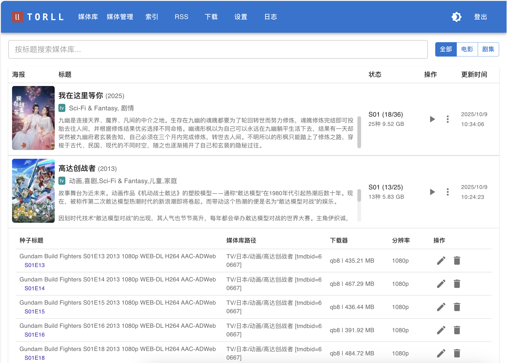
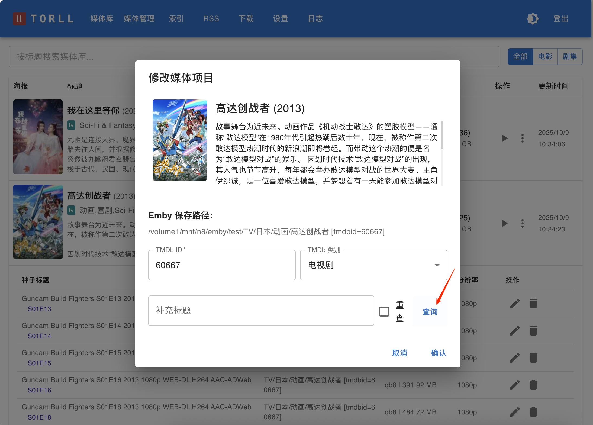

# 媒体库与媒体管理

媒体库是 `torll2` 的最终成果展示，它将所有下载、整理完毕的媒体文件，按电影或剧集进行聚合，并以海报墙的形式清晰地展示出来。你可以在 **“媒体库”** 和 **“媒体管理”** 页面访问此功能。

=== "媒体库"
    

=== "媒体管理"
    

=== "媒体修改"
    
---

## 媒体条目 (Entry)

媒体库中的每一个“卡片”都是一个媒体条目，它代表一部电影或一部剧集，并聚合了与该影视相关的所有已下载文件。

### 媒体条目操作

在每个媒体条目的封面上，通常有两个高级操作按钮：

1.  **刷新状态 (`/scan`)**: 
    - **作用**: 这个功能会重新扫描该媒体条目关联的所有物理文件，主要用于更新剧集的下载状态。
    - **适用场景**: 当你手动添加了某部剧集的后续几集，或者文件发生变化后，`torll2` 内部记录的剧集下载状态（例如，“已下载 5/10 集”）可能没有及时更新。点击此按钮，`torll2` 会检查文件，并刷新这个状态。

2.  **重建硬链 (`/redo-hardlink`)**:
    - **作用**: 对该媒体条目关联的 **所有** 文件，重新执行一次 `rcp` 脚本定义的硬链接/移动操作。
    - **适用场景**: 当你修改了“设置 -> TORCP 设置”中的文件命名模板，并希望将这个新规则应用到已经入库的媒体上时，此功能非常有用。它会根据新模板，在目标位置重新生成一套硬链接文件，并删除旧的链接。

---

## 关联的种子/文件列表

在每个媒体条目下方，会有一个列表，展示构成该条目的所有独立的下载任务（即种子文件）。列表的每一行都包含了丰富的信息，帮助你追溯来源和管理文件。

### 字段说明

- **种子标题 (`torname`)**: 原始种子的标题，让你知道这个文件来源于哪个种子。
- **媒体库路径 (`emby_relpath`)**: 文件被 `rcp` 脚本处理后，在媒体库中的相对路径。这个路径与你在下载器中设置的“本地映射路径 (`Local Map Path`)”相结合，构成了文件的完整物理路径。
- **下载器 (`downloader`)**: 完成此下载任务的下载客户端的名称。
- **分辨率 (`resolution`)**: 从种子标题中解析出的分辨率信息，例如 `1080p`, `2160p` 等。

### 单个文件操作

在文件列表的每一行末尾，通常还有针对这一个文件的操作按钮：

1.  **修改 (`/modify`)**:
    - **作用**: 手动修正 `torll2` 的识别结果。如果系统将一个文件错误地关联到了某个电影/剧集，你可以通过此功能，输入正确的 TMDb ID，将其重新关联到正确的媒体条目上。

2.  **删除 (`/delete`)**:
    - **作用**: 从媒体库中移除这个文件记录，并提供选项让你决定如何处理物理文件。
    - **删除选项**:
        - **删除记录**: 仅从 `torll2` 的数据库中删除这条记录，硬盘上的文件不受影响。
        - **删除种子**: 在删除记录的同时，还会命令下载器删除对应的种子（**不删除文件**）。
        - **删除文件**: 在删除记录和种子的同时，**还会将硬盘上对应的媒体文件一并删除**。这是一个危险操作，请谨慎使用。
