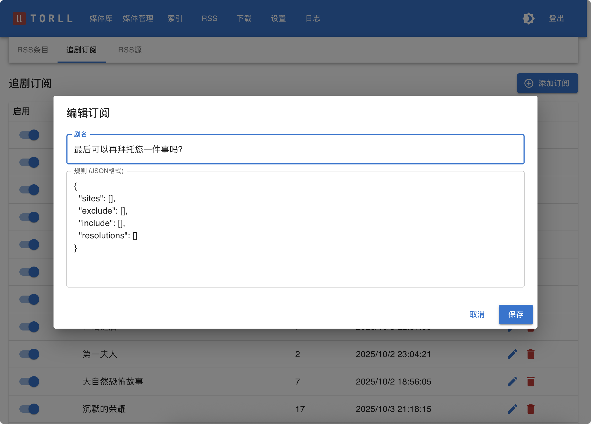

# 追剧订阅

“追剧订阅”是 `torll2` 中一个强大且高度自动化的功能，它允许你精确地订阅某一部剧集，并为其量身定制一套独立的下载规则。当 RSS 源中出现符合你要求的剧集更新时，系统会自动将其下载。

**入口**: RSS -> 追剧订阅

=== "追剧订阅"


---

## 工作原理

1.  你通过关键字 创建一个剧集订阅，并编写好过滤规则。
2.  `torll2` 的 RSS 服务在后台持续扫描所有已启用的 RSS 源。
3.  当发现一个种子的标题与你订阅的剧集信息匹配时，系统会立刻用你为该订阅设定的 `rules` 进行检查。
4.  只有当种子 **完全满足** 所有规则时，才会被发送到下载器。

## 配置项说明

在“添加订阅”或编辑订阅时，你需要填写以下字段：

- **剧名 (`name`)**: 为你的订阅起一个用于匹配的名字，例如“苍穹浩瀚”。
- **启用 (`enabled`)**: 是否激活此订阅。如果取消勾选，系统将暂时忽略此订阅的所有规则。
- **规则 (`rules`)**: 针对此订阅的专属过滤器，格式为 JSON。只有满足所有规则的种子才会被下载。

### 规则 (`rules`) 示例


```json
{
  "sites": ["audiences"],
  "exclude": ["x264"],
  "include": ["NF"],
  "resolutions": ["2160p"],
  "size_gb_max": 35,
  "size_gb_min": 2,
}
```

**可用的规则字段** 请参考“RSS 配置与使用”文档中的过滤器字段说明。

