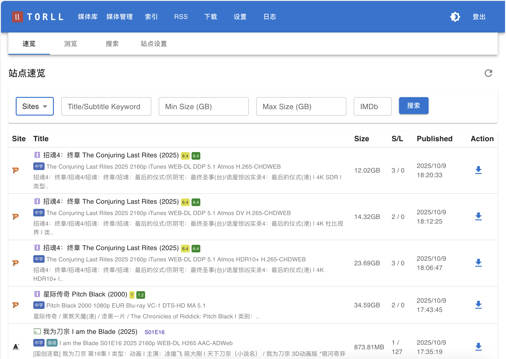
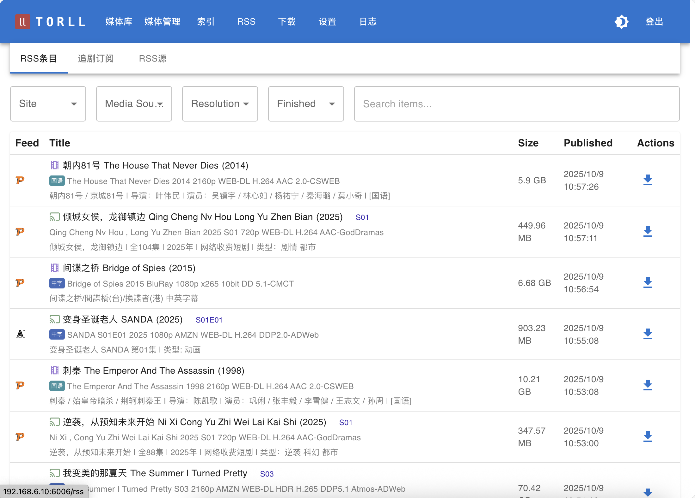
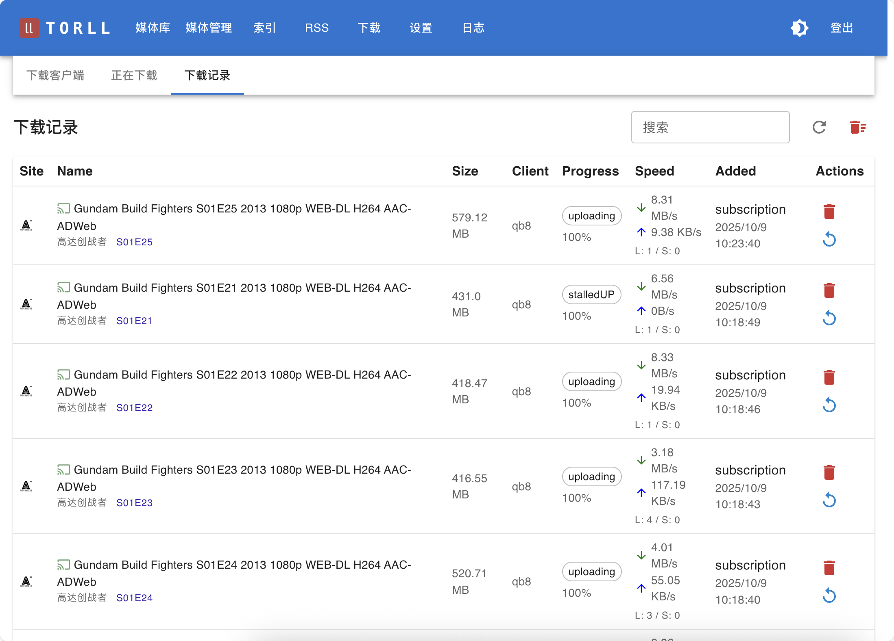

# 欢迎使用 TORLL2

TORLL2 是一个为 PT 爱好者设计的全自动媒体管理系统。

## 写在前面
* 项目是为pt圈的朋友们便利应用所写，源码随docker释出
* 不欢迎商业应用
* 安全方面，在公网使用请自己多加小心

## 功能一览

=== "媒体库"

    

=== "索引"

    

=== "RSS条目"

    

=== "下载任务"

    

---

## 最近更新
* **2025-11-20**: mteam支持；cross-seeder优化；
* **2025-11-15**： 并行搜索；Jackett Plugin; nexusphp api 准备；
* **2025-11-9**:  CookieCloud 插件；简单的辅种插件; QbUtil 插件 等
* **2025-11-2**:  安全性审查加固，所有端点作认证；远程机器删除硬链文件；媒体标记(正在看，不想看，已看完...) ；根据标记清理空间；一些默认值，方便 Docker 使用者；
* **2025-10-28**: 下载模块改为单例后台排队，解决卡死以及竞态等问题；数据库少量修改，更新需要删除 mysql_data volume 或者手工进后台 `alembic upgrade head`；
* **2025-10-26**: 搜索功能：支持 Prowlarr；刮削：local, agent后台刷新机制大量修正；
* **2025-10-08**: 远程 rcp_agent 实现远程下载器中的种子改名硬链、修改、重建
* **2025-09-19**: 支持 `arm64` 和 `amd64` 架构的 buildx 构建。
* **更早**: 项目基本成型。