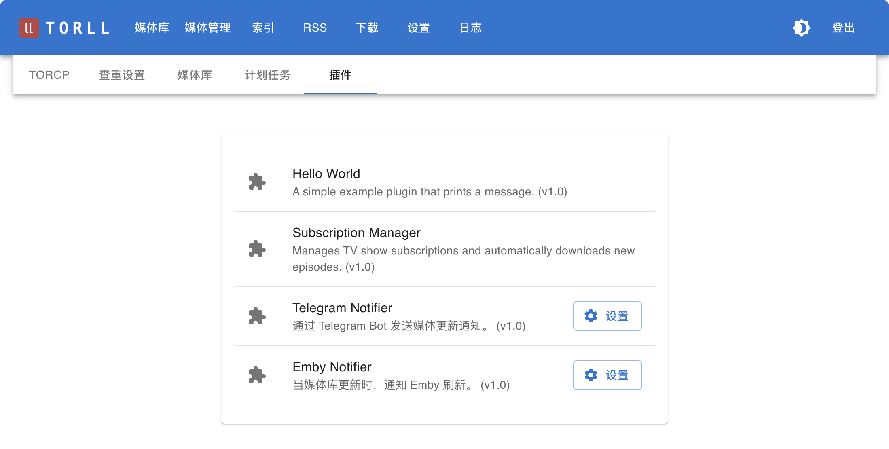

# 插件设置

插件用于扩展 `torll2` 的功能，例如发送通知。你可以在 **设置** -> **插件** 页面查看和管理所有可用插件。

---

## 1. Telegram Notifier

此插件可以在媒体库成功添加新内容（下载完成并整理完毕）时，通过一个 Telegram Bot 发送图文通知。

### 配置项

- **启用 Telegram 通知 (`enabled`)**: 勾选此项以启用插件。
- **Telegram Bot Token (`token`)**: 你的 Telegram Bot 的 Token。你可以从 BotFather 获取。
- **Chat ID (`chat_id`)**: 接收通知的聊天 ID。可以是你的个人 ID，也可以是群组或频道的 ID。
- **消息模板 (`message_template`)**: 自定义通知消息的格式。这是一个支持变量的文本框，你可以自由组织消息内容。

  **可用变量**:
  - `{media_type_icon}`: 媒体类型图标 (🎬 或 🎥)
  - `{media_type_text}`: 媒体类型文字 (电影或剧集)
  - `{title}`: 标题
  - `{year}`: 年份
  - `{torname}`: 种子名称
  - `{downloader}`: 下载器名称
  - `{size}`: 文件大小
  - `{path}`: 文件相对路径
  - `{overview}`: 剧情简介

  **默认模板示例**:
  ```
  **{media_type_icon}{media_type_text}:**  **{title}** ({year}) {tvinfo}

  **种子:** {torname}
  **下载器:** {downloader} | {size}
  **路径** `{path}`
  ```

---

## 2. Emby Notifier

此插件的功能非常专一：当 `torll2` 的媒体库有内容更新时，它会自动向你的 Emby/Jellyfin 服务器发送一个“刷新媒体库”的 API 请求，从而实现媒体的即时入库，无需等待 Emby 的定时扫描。

### 配置项

- **启用 Emby 通知 (`enabled`)**: 勾选此项以启用插件。
- **Emby 主机地址 (`host`)**: 你的 Emby 或 Jellyfin 服务器的 URL 地址。
  - **示例**: `http://192.168.1.10:8096`
- **Emby API 密钥 (`api_key`)**: 用于 API 访问的密钥。你可以在 Emby/Jellyfin 的管理后台 -> API 密钥 页面生成一个。

## 截图

