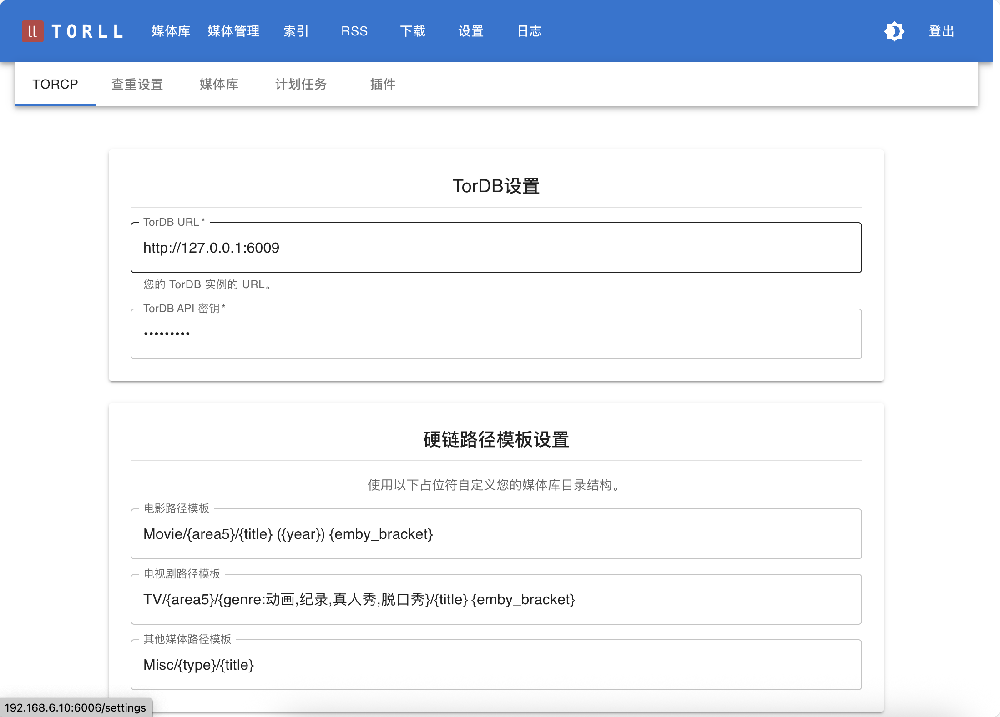

# TORCP 设置

TORCP 是 `torll2` 与 `tordb` 服务之间沟通的桥梁，它负责解析种子信息、获取元数据，并根据设定的模板生成最终的目录结构和文件名。此处的配置将直接影响 `rcp` 脚本整理文件后的效果。

**入口**: 设置 -> TORCP 服务设置

=== "TORCP设置"

    
---

## 配置项说明

### 1. TorDB URL

- **说明**: `tordb` 服务的 URL 地址。
- **示例**: 如果 `tordb` 和 `torll2` 在同一个 Docker 网络中，应填写 `http://tordb:6009`。

### 2. TorDB API Key

- **说明**: 访问 `tordb` 服务所需的 API 密钥。此密钥必须与 `tordb` 启动时在 `.env` 文件中设置的 `TORDB_API_KEY` 完全一致。

### 4. 目录/文件命名模板

这部分是 TORCP 设置的核心，它决定了媒体文件在硬链接或移动后的目录结构和文件名格式。

- **电影路径模板 (`movie_path_template`)**: 用于电影的命名规则。
- **剧集路径模板 (`tv_path_template`)**: 用于电视剧的命名规则。
- **其他路径模板 (`other_path_template`)**: 用于其他未识别类型的媒体。

**可用变量**: 模板中可以使用一系列由 `tordb` 解析出的变量，例如：
- `{type}`  媒体类型 (Movie, TV, Music, Misc)
- `{title}` 标题
- `{year}`  年份
- `{area}` 国家/地区代码 (例如: US, JP)
- `{area5}` 五大地区分类 (欧美, 港台, 日本，韩国, 大陆, 其他地区)
- `{genre:动画,纪录}`  指定类型分类，若匹配则使用类型名，否则为“其他”
- `{emby_bracket}` Emby风格的TMDb ID, [tmdbid=...]
- `{plex_bracket}` Plex风格的TMDb ID, {tmdb-...}

**示例**: 
```
TV/{area5}/{genre:动画,纪录}/{title} {emby_bracket}
```
生成路径: 
```
TV/日韩/动画/间谍过家家 [tmdbid=12345]
```

**默认模板示例**:
- `Movie/{area5}/{title} ({year}) {emby_bracket}`
- `TV/{area5}/{title} {emby_bracket}`


